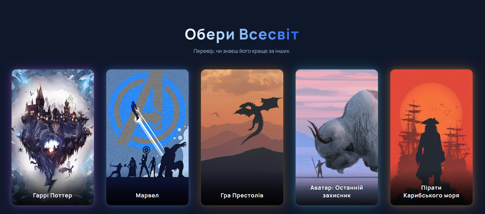
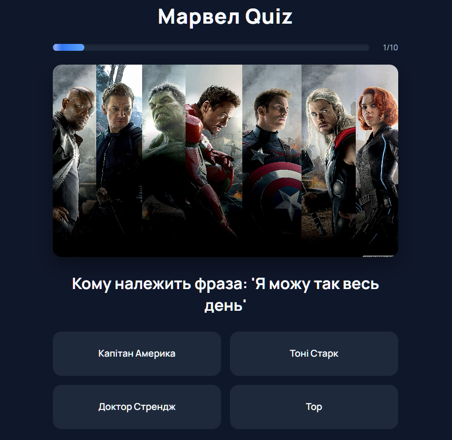
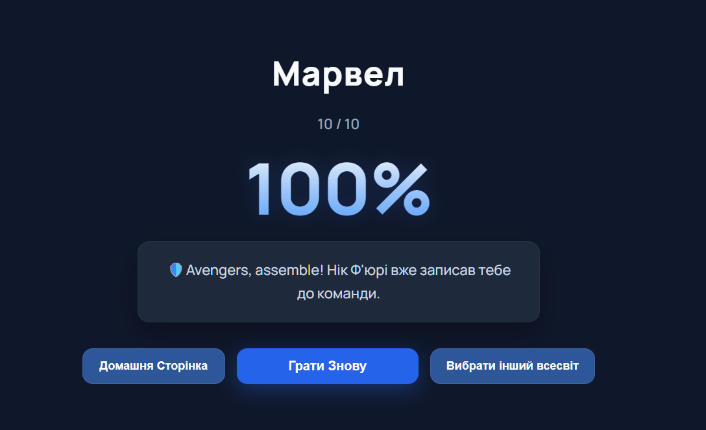

# 🎮 GeekQuiz

GeekQuiz is a single-page quiz application where users can test their knowledge of popular fictional universes.

## ✨ Features

- 5 different universes
- Multiple-choice questions
- Animated progress bar
- Instant answer feedback
- Final score screen
- Responsive layout
- Smooth page transitions

## 🛠 Technologies

- HTML5
- CSS3
- JavaScript (ES6 Modules)

## 📚 Universes

- Harry Potter
- Marvel
- Avatar: The Last Airbender
- Game of Thrones
- Pirates of the Caribbean

## 🚀 Live Demo

Coming soon...

## 📸 Screenshots

### Welcome Page


### Universe Selection



### Quiz



### Results



## ▶️ Getting Started

Clone the repository:

```bash
git clone https://github.com/Nazar-Ferents/GeekQuiz.git
```

Open the project folder:

```bash
cd geekquiz
```

Run the project using **Live Server** or open `index.html` in your browser.

## 📈 Future Improvements

- Difficulty levels
- Timer mode
- Sound effects
- Leaderboard
- More universes
- Save progress with LocalStorage

## 👨‍💻 Author

**Nazar Ferents**

GitHub: https://github.com/Nazar-Ferents
